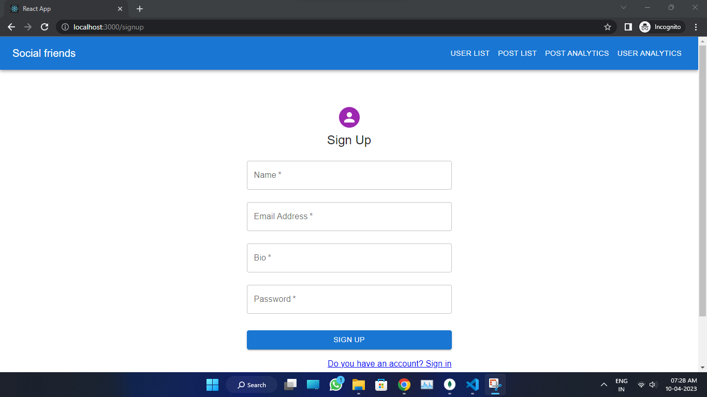
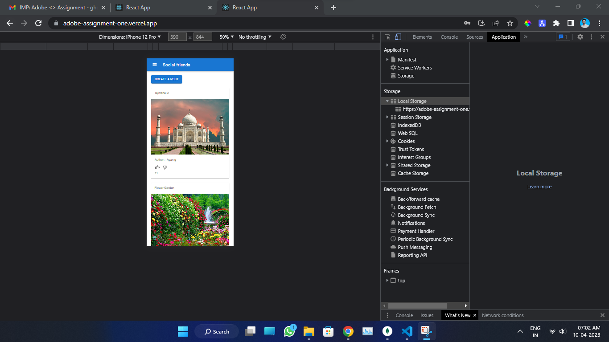
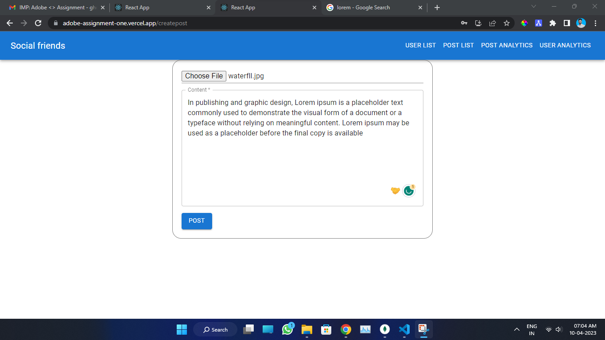
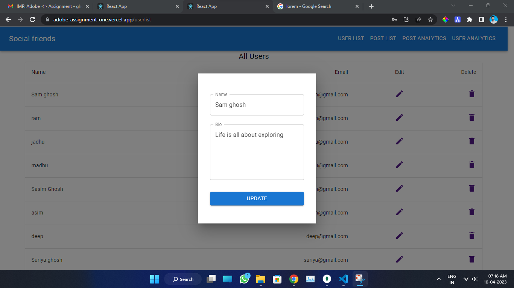
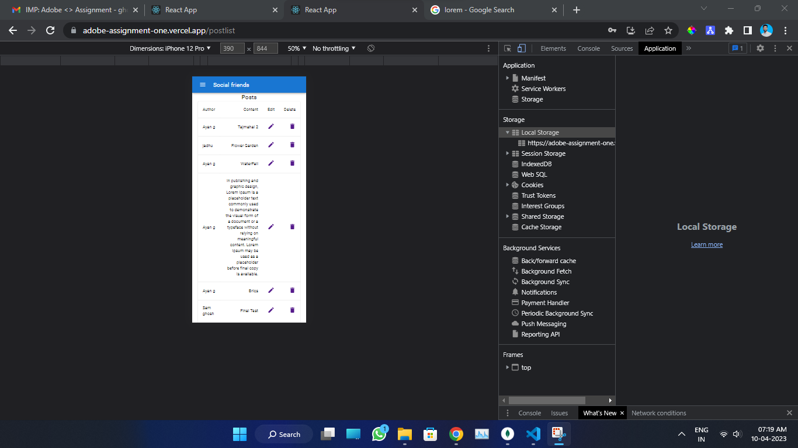
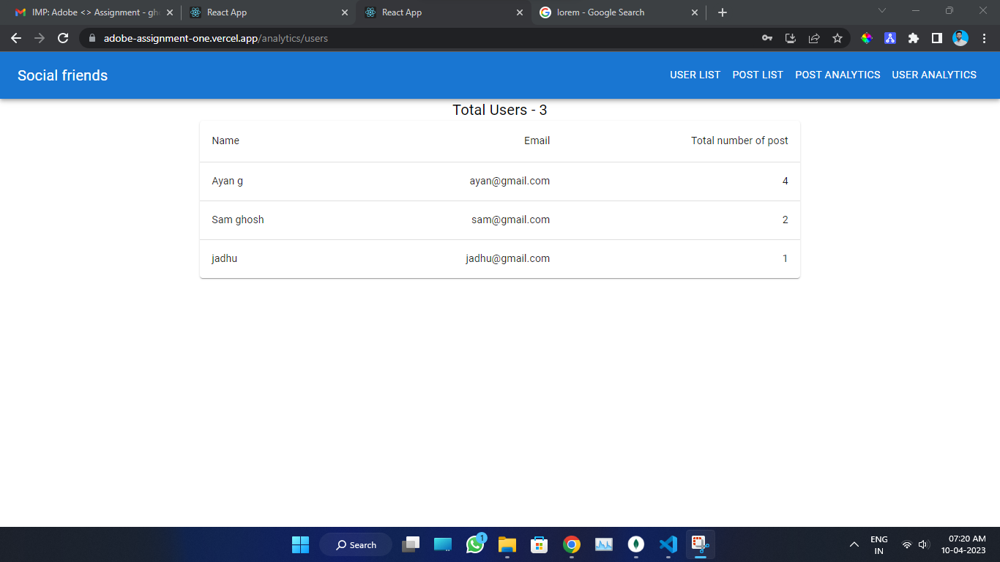
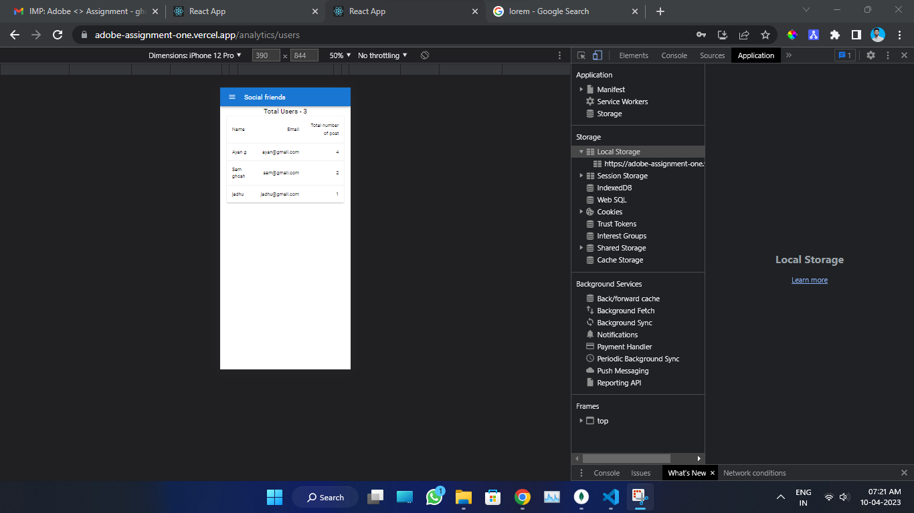
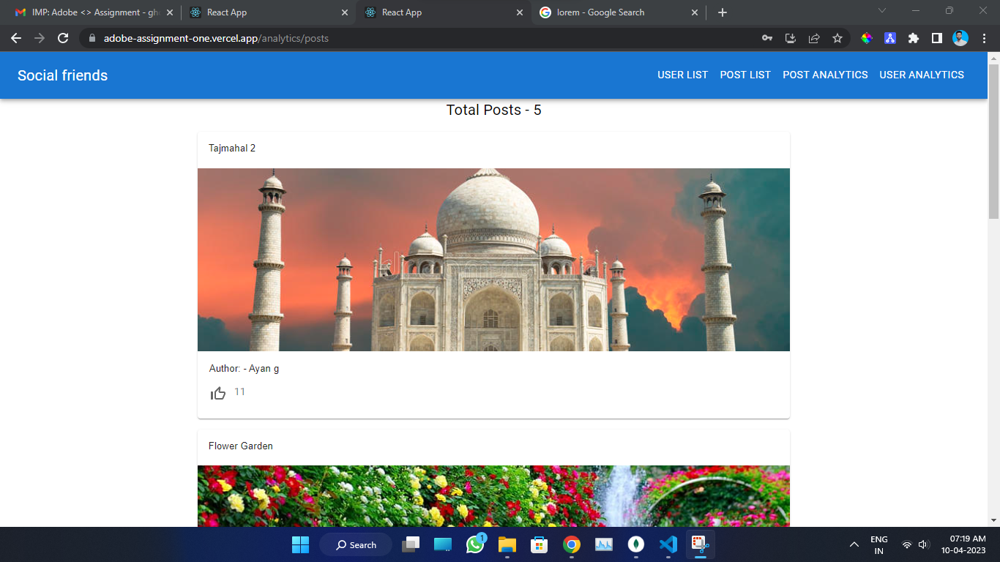
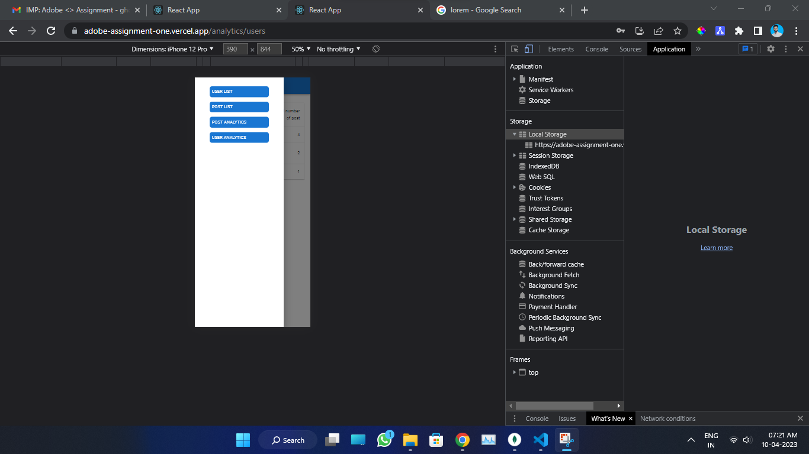

# Adobe Assignment

### This is a small social media web app here user can post images, and content, & they can update their post and user.

- Live link- https://adobe-assignment-one.vercel.app
- Backend api live link - https://adobe-assignment-production.up.railway.app

### Techstack

- React
- MUI
- Node.js
- Express.js
- MongoDB
- Cloudniary ( for storing images)

### For locally run this code 
 - clone this repo
 - use npm i 
 - npm start 

 ### Here are some Screenshoot of my life social media web app

    # Signup page
    - first user have to login or sign up then they can access this website 
    - You have to fill everyfeild and for name upto 50 character and bio upto 200 

  

    # login page
    - You have to fill everyfeild  
  

    # Home page desktop view
    - Here user can like and dislike the post
 
       
    # Home page mobile view 
  

    # Create post form
    - Here user can select their image from their local 
  

    # All User list 
    - Here user can delete their accout and they can update 
 
     # All User list 
    - Here user can delete their accout and they can update 
 
  
     # All Post list 
    - Here user can delete their post and they can update 
 

    # Top active users 

    # Most liked post
    

    # mobile view navbar 
      

  

 
